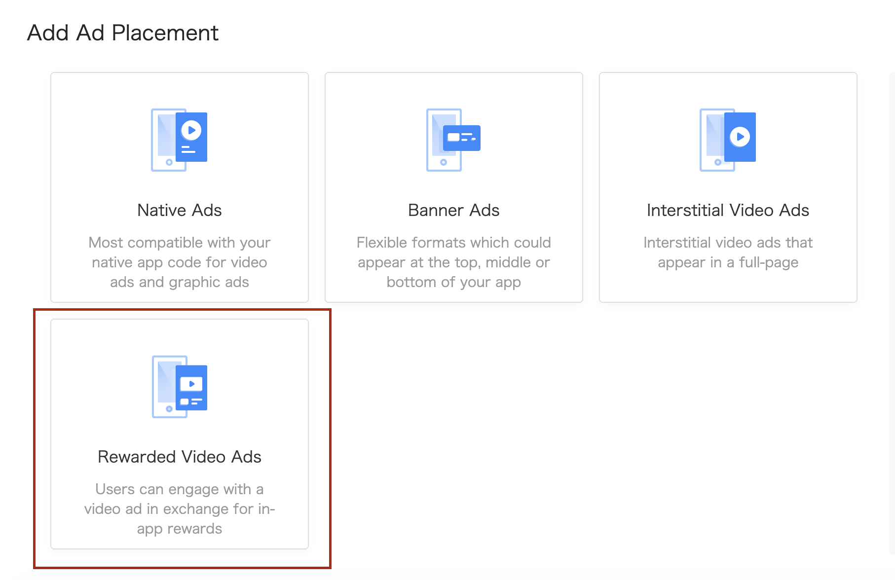

# Rewarded Video Ads

Here is the common methods and delegate to use for building pangle 's reward video's adapter.

  * [Create placement](#start/create_placement)
  * [Loading ads and display](#start/reward_ad_load)


Please [initialize the Pangle SDK](1_prerequisites_initialize) before loading ads.


<a name="start/create_placement"></a>
### Create the placement for reward video ad
On Pangle platform, create an **Rewarded Video Ads** ad in the app, you will get a **placement ID** for ad's loading.

Please set the ad's `Orientation` to fit for the app.
`rewards name` and `rewards quantity` can be random if not needed.


  <br>


<a name="start/reward_ad_load"></a>
### Loading Ads


#### 1.Load a reward video ad and display

Create a `AdSlot` instance with the placementID.

```java
AdSlot adSlot = new AdSlot.Builder()
        .setCodeId("Your_Ad_Placement_Id")
        .build();
```


Use `TTAdNative createAdNative(Context var1);` in `TTAdManager` to create a TTAdNative's instance.

Use `void loadRewardVideoAd(AdSlot var1, @NonNull TTAdNative.RewardVideoAdListener var2);` in the TTAdNative's instance to load the ad.

After get the ad's load succeed callback by the listener, use `TTRewardVideoAd`'s `void showRewardVideoAd(Activity var1);` to show the ad.

#### 2.Get load's callback from the listener

`RewardVideoAdListener` is the listener indicates the result of ad's load.

| methods | description |
| :--- | :--- |
| onError(i: Int, msg: String) | This method is invoked when an ad fails to load.  |
| onRewardVideoAdLoad(ttRewardVideoAd: TTRewardVideoAd) | Ad load succeed(video content is no cached), can show ad after here. |
| onRewardVideoCached() | Ad load succeed and video content is cached, recommend to show ad after here. |


#### 3.Indicates reward video's status

When getting callback from `RewardVideoAdListener`, a `TTRewardVideoAd` will be sent in the callback method if load succeed.

`RewardAdInteractionListener` in the `TTRewardVideoAd` is the listener to indicates the reward video's status.

| methods | description |
| :--- | :--- |
| onAdShow() |  This method is called when video has been shown. |
| onAdVideoBarClick() | This method is called when video ad is clicked. |
| onAdClose() | This method is called when video ad is closed. |
| onVideoComplete() | This method is called when video ad play completed. |
| onVideoError() | This method is called when an error occurred. |
| onRewardVerify(boolean rewardVerify, int rewardAmout, String rewardName) | The method is invoked when the user should be rewarded. Parameter: rewardVerify: sdk will return true if the user meet the our requirements, for example, the video has finished playing. rewardName: The name of reward item you entered on Pangle platform. rewardAmout: The number of reward items you entered on Pangle platform. |
| onSkippedVideo() | This method is called when the user clicked skip button. |
