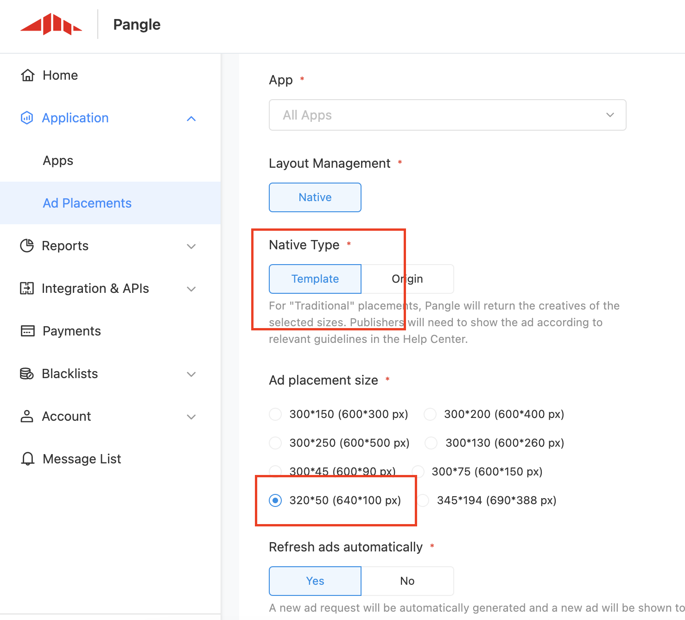

# Banner Ads

Here is the common methods and delegate to use for building pangle's banner adapter.

  * [Create placement](#start/create_placement)
  * [Loading Ads](#start/template_banner_ad_load)


Please [initialize the Pangle SDK](1_prerequisites_initialize) before loading ads.


<a name="start/create_placement"></a>
### Create the placement for banner ad

On Pangle platform, create an **Banner Ads** ad in the app.

Plase set **Template** at [Native type].

You will get a **placement ID** for ad's loading.


**Please select 300 * 250 (600 * 500 px)  for 300*250.**


**Please select 320 * 50 (640 * 100 px)  for 320*50.**



<a name="start/template_banner_ad_load"></a>
### Loading Ads

#### 1.Load a banner

Create a `AdSlot` instance with the placementID.

`setExpressViewAcceptedSize` is **required**. Please set the banner's width and height here.

```java
AdSlot adSlot = new AdSlot.Builder()
        .setCodeId("Your_Ad_Placement_Id")
        .setExpressViewAcceptedSize(banner's width, banner's height)
        .build();
```

Use `TTAdNative createAdNative(Context var1);` in `TTAdManager` to create a TTAdNative's instance.

Use ` void loadBannerExpressAd(AdSlot var1, @NonNull TTAdNative.NativeExpressAdListener var2);` in the TTAdNative's instance to load the ad.

`TTAdNative.NativeExpressAdListener` will be informed about the load status.


#### 2.Get callback from the ad loader listener

`TTAdNative.NativeExpressAdListener` indicates the result of ad's load.

| methods | description |
| :--- | :--- |
| onError(i: Int, msg: String) | This method is invoked when an ad fails to load.  |
| void onNativeExpressAdLoad(List<TTNativeExpressAd> var1);| A banner list loaded, get the element in it and **must** call `void render();` and set `void setExpressInteractionListener(TTNativeExpressAd.ExpressAdInteractionListener var1);` to render the ad and get render status. |

* The TTNativeExpressAd's instance here is not ready to be displayed. Need to call `render()`. Rendering status will be informed from `TTNativeExpressAd.ExpressAdInteractionListener`.

#### 3.Get callback from the ad render listener

`TTNativeExpressAd.ExpressAdInteractionListener` indicates the result of ad's load.

| methods | when be called by pangle sdk |
| :--- | :--- |
| void onRenderSuccess(View var1, float var2, float var3); | Ad rendering succeeded, the view can be added and displayed. |
| void onRenderFail(View var1, String var2, int var3); | Ad rendering failed |
| void onAdShow(View var1, int var2); | When the ad is showed |
| void onAdClicked(View var1, int var2); | When the ad is clicked  |
