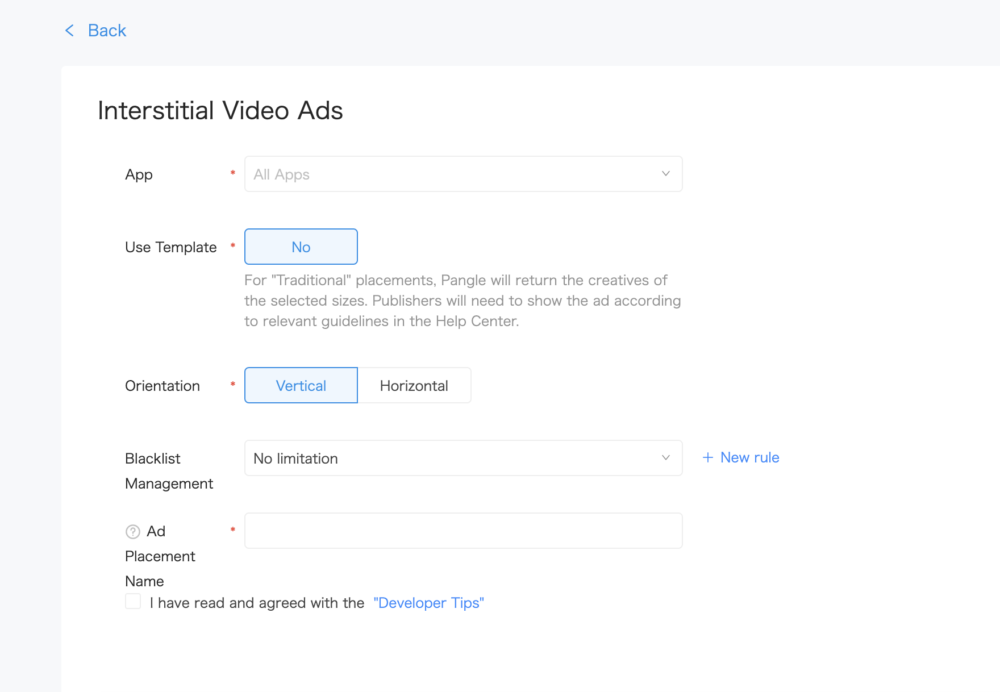

# Interstitial Video Ads

Here is the common methods and delegate to use for building pangle 's interstitial video's adapter.

  * [Create placement](#start/create_placement)
  * [Loading ads and display](#start/fullscreen_ad_load)


Please [initialize the Pangle SDK](1_prerequisites_initialize) before loading ads.


<a name="start/create_placement"></a>
### Create the placement for full screen video ad
On Pangle platform, create an **Interstitial Video Ads** ad in the app, you will get a **placement ID** for ad's loading.

Please set the ad's `Orientation` to fit for the app.

  <br>



<a name="start/fullscreen_ad_load"></a>
### Loading Ads


#### 1.Load a reward video ad and display

Init a `BUFullscreenVideoAd` instance, and set the slotID(placementID) by `- (instancetype)initWithSlotID:(NSString *)slotID;`.

Use `- (void)loadAdData;` to load an interstitial ad.

`BUFullscreenVideoAdDelegate` will be called when ad's load succeed and use `(BOOL)showAdFromRootViewController:(UIViewController *)rootViewController;` to show the ad.

| methods/parameters | description |
| :--- | :--- |
| - (instancetype)initWithSlotID:(NSString *)slotID; | Create a object with soltID(placementID) |
| @property (nonatomic, weak, nullable) id< BUFullscreenVideoAdDelegate > delegate; | This is a **must be** set parameter to get callback from ad load|
| - (void)loadAdData; | Use this to load an ad after `initWithSlotID` |
| - (BOOL)showAdFromRootViewController:(UIViewController *)rootViewController; | Use this to show the ad if ad load succeed |


#### 2.Get callback from the delegate

The `BUFullscreenVideoAdDelegate`'s instance you set in the ad load, will give you the callback of load and display status.

##### Basic callback for common use:

| methods | when be called by pangle sdk |
| :--- | :--- |
| - (void)fullscreenVideoMaterialMetaAdDidLoad:(BUFullscreenVideoAd *)fullscreenVideoAd; | Ad load succeed(video content is no cached), can show ad after here |
| - (void)fullscreenVideoAd:(BUFullscreenVideoAd *)fullscreenVideoAd didFailWithError:(NSError *_Nullable)error; | Ad load failed |
| - (void)fullscreenVideoAdVideoDataDidLoad:(BUFullscreenVideoAd *)fullscreenVideoAd; | Ad load succeed and video content is cached, recommend to show ad after here |
| - (void)fullscreenVideoAdDidVisible:(BUFullscreenVideoAd *)fullscreenVideoAd; | When the ad on the front and become visible  |
| - (void)fullscreenVideoAdDidClose:(BUFullscreenVideoAd *)fullscreenVideoAd; | When the ad become invisible |
| - (void)fullscreenVideoAdDidClick:(BUFullscreenVideoAd *)fullscreenVideoAd; | When the ad is clicked |

##### All callback interface

```obj-c
@protocol BUFullscreenVideoAdDelegate <NSObject>

@optional

/**
 This method is called when video ad material loaded successfully.
 */
- (void)fullscreenVideoMaterialMetaAdDidLoad:(BUFullscreenVideoAd *)fullscreenVideoAd;

/**
 This method is called when video ad materia failed to load.
 @param error : the reason of error
 */
- (void)fullscreenVideoAd:(BUFullscreenVideoAd *)fullscreenVideoAd didFailWithError:(NSError *_Nullable)error;

/**
 This method is called when video cached successfully.
 */
- (void)fullscreenVideoAdVideoDataDidLoad:(BUFullscreenVideoAd *)fullscreenVideoAd;

/**
 This method is called when video ad slot will be showing.
 */
- (void)fullscreenVideoAdWillVisible:(BUFullscreenVideoAd *)fullscreenVideoAd;

/**
 This method is called when video ad slot has been shown.
 */
- (void)fullscreenVideoAdDidVisible:(BUFullscreenVideoAd *)fullscreenVideoAd;

/**
 This method is called when video ad is clicked.
 */
- (void)fullscreenVideoAdDidClick:(BUFullscreenVideoAd *)fullscreenVideoAd;

/**
 This method is called when video ad is about to close.
 */
- (void)fullscreenVideoAdWillClose:(BUFullscreenVideoAd *)fullscreenVideoAd;

/**
 This method is called when video ad is closed.
 */
- (void)fullscreenVideoAdDidClose:(BUFullscreenVideoAd *)fullscreenVideoAd;


/**
 This method is called when video ad play completed or an error occurred.
 @param error : the reason of error
 */
- (void)fullscreenVideoAdDidPlayFinish:(BUFullscreenVideoAd *)fullscreenVideoAd didFailWithError:(NSError *_Nullable)error;

/**
 This method is called when the user clicked skip button.
 */
- (void)fullscreenVideoAdDidClickSkip:(BUFullscreenVideoAd *)fullscreenVideoAd;

/**
this method is used to get the type of fullscreen video ad
 */
- (void)fullscreenVideoAdCallback:(BUFullscreenVideoAd *)fullscreenVideoAd withType:(BUFullScreenVideoAdType)fullscreenVideoAdType;

@end

```
