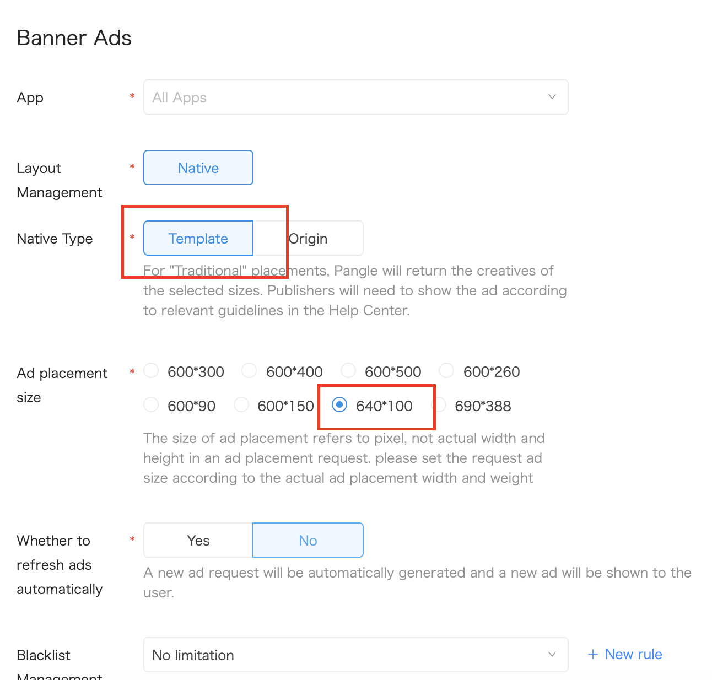

# Banner Ads

Here is the common methods and delegate to use for building pangle's banner adapter.

  * [Create placement](#start/create_placement)
  * [Loading Ads](#start/template_banner_ad_load)


Please [initialize the Pangle SDK](1_prerequisites_initialize) before loading ads.


<a name="start/create_placement"></a>
### Create the placement for banner ad

On Pangle platform, create an **Banner Ads** ad in the app.

Plase set **Template** at [Native type].

You will get a **placement ID** for ad's loading.


**Please select [600 * 500]  for 300*250.**


**Please select [640 * 100]  for 320*50.**



<a name="start/template_banner_ad_load"></a>
### Loading Ads

#### 1.Load a banner


Create a `BUNativeExpressBannerView` for setting slotID(placementID), rootViewController and size of banner.


| methods/parameters | description |
| :--- | :--- |
| - (instancetype)initWithSlotID:(NSString *)slotID rootViewController:(UIViewController *)rootViewController adSize:(CGSize)adsize; | Create a object with soltID(placementID),<br>rootViewController for loading <br>CGSize for the size of banner.**Please set this size to 300 * 250 or 320 * 50** |
| @property (nonatomic, weak, nullable) id< BUNativeExpressBannerViewDelegate > delegate; | This is a **must be** set parameter to get callback from ad load|
| - (void)loadAdData; | Use this to load an ad after `initWithSlotID` |


#### 2.Get callback from the delegate

`BUNativeExpressBannerViewDelegate` indicates the result of ad's load.

##### Basic callback for common use:

| methods | when be called by pangle sdk |
| :--- | :--- |
| - (void)nativeExpressBannerAdViewDidLoad:(BUNativeExpressBannerView *)bannerAdView; | Ad load succeed but not rendered yet |
| - (void)nativeExpressBannerAdView:(BUNativeExpressBannerView *)bannerAdView didLoadFailWithError:(NSError *_Nullable)error; | Ad load failed |
| - (void)nativeExpressBannerAdViewRenderSuccess:(BUNativeExpressBannerView *)bannerAdView; | Ad rendered successfully and `bannerAdView` ready to be show |
| - (void)nativeExpressBannerAdViewRenderFail:(BUNativeExpressBannerView *)bannerAdView error:(NSError * __nullable)error; | Ad failed on render   |
| - (void)nativeExpressBannerAdViewDidClick:(BUNativeExpressBannerView *)bannerAdView; | When the ad is clicked |

##### All callback interface

```obj-c
@protocol BUNativeExpressBannerViewDelegate <NSObject>

@optional
/**
 This method is called when bannerAdView ad slot loaded successfully.
 @param bannerAdView : view for bannerAdView
 */
- (void)nativeExpressBannerAdViewDidLoad:(BUNativeExpressBannerView *)bannerAdView;

/**
 This method is called when bannerAdView ad slot failed to load.
 @param error : the reason of error
 */
- (void)nativeExpressBannerAdView:(BUNativeExpressBannerView *)bannerAdView didLoadFailWithError:(NSError *_Nullable)error;

/**
 This method is called when rendering a nativeExpressAdView successed.
 */
- (void)nativeExpressBannerAdViewRenderSuccess:(BUNativeExpressBannerView *)bannerAdView;

/**
 This method is called when a nativeExpressAdView failed to render.
 @param error : the reason of error
 */
- (void)nativeExpressBannerAdViewRenderFail:(BUNativeExpressBannerView *)bannerAdView error:(NSError * __nullable)error;

/**
 This method is called when bannerAdView ad slot showed new ad.
 */
- (void)nativeExpressBannerAdViewWillBecomVisible:(BUNativeExpressBannerView *)bannerAdView;

/**
 This method is called when bannerAdView is clicked.
 */
- (void)nativeExpressBannerAdViewDidClick:(BUNativeExpressBannerView *)bannerAdView;

/**
 This method is called when the user clicked dislike button and chose dislike reasons.
 @param filterwords : the array of reasons for dislike.
 */
- (void)nativeExpressBannerAdView:(BUNativeExpressBannerView *)bannerAdView dislikeWithReason:(NSArray<BUDislikeWords *> *_Nullable)filterwords;

/**
 This method is called when another controller has been closed.
 @param interactionType : open appstore in app or open the webpage or view video ad details page.
 */
- (void)nativeExpressBannerAdViewDidCloseOtherController:(BUNativeExpressBannerView *)bannerAdView interactionType:(BUInteractionType)interactionType;

@end
```
