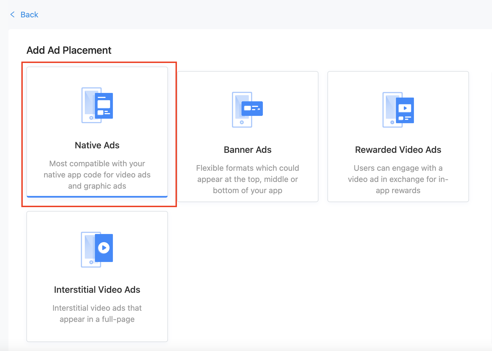
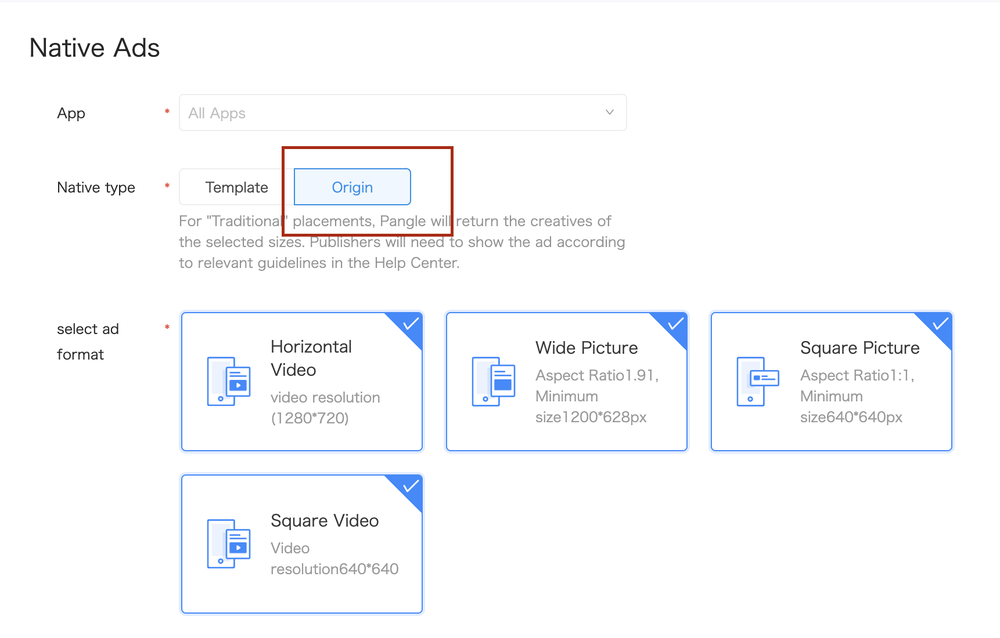

# Native Ads

Here is the common methods and delegate to use for building pangle's native adapter.

  * [Create placement](#start/create_placement)
  * [Loading Ads](#start/native_ad_load)
  * [All elements for native Ads](#start/native_ad_element)

Please [initialize the Pangle SDK](1_prerequisites_initialize) before loading ads.

### Create the placement for native ad

On Pangle platform, create an **Native Ads** ad in the app, you will get a **placement ID** for ad's loading.

* Please set `Native Type` to **Origin**.

   

### Loading Ads

#### 1.Load a native ad

Create a `BUAdSlot` to set slotID(placementID) and other parameters for a native ad.

| parameters | description |
| :--- | :--- |
| ID | Set the slotID(placementID). |
| AdType |  **Must** set `BUAdSlotAdType.feed` for native. |
| imgSize | Set a "BUSize" instance (size's detail is not required).|

Use `BUAdSlot`'s instance to init a '`BUNativeAdsManager`. And calling `- (void)loadAdDataWithCount:(NSInteger)count;` to load ads.

| parameters/methods | description |
| :--- | :--- |
| - (instancetype)initWithSlot:(BUAdSlot * _Nullable) slot; | Create a BUNativeAdsManager for ad's loading. |
| @property (nonatomic, weak, nullable) id< BUNativeAdsManagerDelegate > delegate; |  This is a **must be** set parameter to get callback from ad load |
| - (void)loadAdDataWithCount:(NSInteger)count; | Load ads. We strongly recommend  set it **less than 3**.|

#### 2.Get callback from the delegate

`BUNativeAdsManagerDelegate` indicates the result of ad's load.

| methods | when be called by pangle sdk |
| :--- | :--- |
| - (void)nativeAdsManagerSuccessToLoad:(BUNativeAdsManager *)adsManager nativeAds:(NSArray<BUNativeAd *> *_Nullable)nativeAdDataArray; | Ad load succeed with native ads |
| - (void)nativeAdsManager:(BUNativeAdsManager *)adsManager didFailWithError:(NSError *_Nullable)error; | Ad load failed |

### All elements for native Ads

From `- (void)nativeAdsManagerSuccessToLoad:(BUNativeAdsManager *)adsManager nativeAds:(NSArray<BUNativeAd *> *_Nullable)nativeAdDataArray;`,  you can get a list of **`BUNativeAd`** instance. All contents for the native ad are in this instance.

You **also must** init a `BUNativeAdRelatedView` and call `- (void)refreshData:(BUNativeAd *)nativeAd;` to set video contents for the native ad.

#### Elements in BUNativeAd

| parameters | description |
| :--- | :--- |
| @property (nonatomic, weak, readwrite, nullable) id< BUNativeAdDelegate > delegate | This delegate will inform the status of native ad's load/show/click/etc. |
| @property (nonatomic, weak, readwrite) UIViewController *rootViewController; | This is a **must be** set parameter for SDK to handle ad's actions |
| @property (atomic, strong, readonly, nullable) BUMaterialMeta *data; | Main elements are in this paremeters |

##### Elements in BUMaterialMeta

In BUMaterialMeta you can find listed elements for a native ad.

| parameters | description |
| :--- | :--- |
| AdTitle | Ad's title. |
| AdDescription | Ad's description.  |
| buttonText | The text for the button. |
| imageMode | Type of ad's main content.  If type is equal to a video in the `BUFeedADMode`,it means main content is a video, and video content is in the `BUNativeAdRelatedView`'s instance. Otherwise it's an image ad. |
| imageAry | You can get image ad's image url from here. |
| icon | You can get ad's icon url from here. |

##### Elements in BUNativeAdRelatedView

In `BUNativeAdRelatedView` t

| methods/parameters | description |
| :--- | :--- |
| @property (nonatomic, strong, readonly, nullable) UIImageView *logoADImageView; | This is an ad provider(Pangle) logo, and click this logo will show a privacy policy page. |
| @property (nonatomic, strong, readonly, nullable) UILabel *adLabel; | Ad's label.  |
| @property (nonatomic, strong, readonly, nullable) UIButton *dislikeButton; | This is a feedback button for user to choose several opinions to the ad. |
| @property (nonatomic, strong, readonly, nullable) BUVideoAdView *videoAdView; | If `imageMode` in the `BUMaterialMeta`'s instance is a video type, you can get video content here.  |
| - (void)refreshData:(BUNativeAd *)nativeAd; | This method **must be called** after you get the `BUNativeAd` instance from `nativeAdsManagerSuccessToLoad` |
